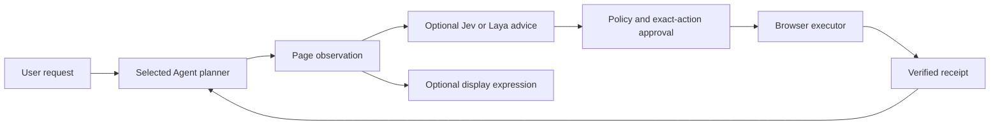

# Agent runtimes and decision services

Jot keeps conversation ownership, visible task state and file delivery outside the model loop. A planner interprets a request; execution services produce receipts; the application presents the result. This gives different runtimes an integration boundary without pretending their events or permissions are interchangeable.

## What is included

| Integration | Included code | Readiness |
| --- | --- | --- |
| Compatible model endpoint | Root `src/provider.mjs` and `src/agent.mjs` | Runnable portable loop; requires a real streaming/function-tool provider |
| DSH Session host | `packages/session-adapter` and gateway harness modules | Adapter/source included; external host, presets and tools required |
| pi Agent | Integration design below | No pi dependency or adapter implemented in this release |
| Other Agent SDKs or remote runtimes | Proposed lifecycle contract below | Requires an adapter and per-runtime acceptance |
| OpenJev / Laya expression advice | Gateway `harness/emotion-advisor.ts` | Provider interface included; endpoints/credentials must be supplied |
| OpenJev / Laya webpage decisions | Proposed policy and external execution-service boundary | Active web decision/execution backend is not bundled |

The root interface uses the portable API. It is not a ready-made frontend for every external runtime.

## What Jot adds around DSH

DSH remains responsible for its planning/session behavior. Jot does not claim to replace its kernel or invent features already provided upstream. Its Session integration uses a Cordis plugin; upstream describes DSH as a plugin-based harness. [Official DSH repository](https://github.com/deepseek-ai/deepseek-harness).

The included application layer adds:

- **Product identity and organization:** owner-scoped projects/conversations; internal host session bindings stay on the server. A trusted authentication proxy is required for remote users.
- **Durable task acceptance:** idempotent message intake, bounded worker leases and persisted task/event state rather than treating an open browser connection as the task itself.
- **Event presentation:** projection of host activity and reply deltas into stable UI events, coalescing of small updates, snapshots and cursor replay. A disconnect is not a completed or cancelled task.
- **Command coordination:** queued cancellation/steering commands and their dispatch state. These commands still rely on the host's actual semantics and receipts.
- **File lifecycle:** upload and generated-artifact records, conversation/run association, separate document jobs and download readiness. External exporters and office dependencies are documented rather than silently assumed available.
- **Optional speech and display advice:** guarded capability/transcription routes and separate expression recommendations, without granting them permission to perform tools.

Some extended capabilities are protocol/storage scaffolding. The included gateway records interaction responses, a selected model and checkpoint references, but the released worker does not yet complete every corresponding host dispatch. Do not advertise end-to-end gateway approvals, per-conversation model switching or checkpoint execution resume based only on route/schema existence or its static capability response. Portable operation-scoped approval is independently implemented and tested.

Relevant implementation: `conversations/`, `projects/`, `runs/`, `events/`, `harness/official-session-runner.ts`, `harness/session-event-projector.ts`, `harness/command-dispatcher.ts`, `artifacts/`, `file-engine/` and `voice/` in the gateway.

These are application-level extensions, not claims that upstream DSH lacks persistence, tools, steering or subagents. This preview does not certify compatibility with all future DSH versions; the adapter declares its peer versions explicitly.

## pi Agent: recommended adapter

The official pi Agent API exposes subscription events, tool hooks, cancellation, steering/follow-up and idle settlement. Those are suitable integration points. The old pi-mono repository currently redirects to `earendil-works/pi`; pin and validate a selected version rather than copying assumptions from an old package name. [Official Agent documentation](https://github.com/earendil-works/pi/tree/main/packages/agent).

A pi adapter should translate events into Jot's durable application model:

| pi boundary | Jot mapping / requirement |
| --- | --- |
| `prompt()` | Accept a durable Jot run before invoking the runtime |
| `message_update` | Reply deltas associated with the current run and message |
| `tool_execution_start/update/end` | Activity progress plus the exact tool-call ID and result |
| `beforeToolCall` | Validate policy and await a specific approval before an effect |
| `afterToolCall` | Store execution evidence; preserve explicit failure/uncertainty |
| `abort()` | Dispatch cancellation, then observe actual settlement |
| `steer()` / `followUp()` | Distinct user commands; do not implement both as another prompt |
| `agent_end` and `waitForIdle()` | Await runtime settlement and persistence before final task settlement |

This table is a design, not executable pi adapter code. Do not treat a tool-batch `turn_end` as final task completion. Preserve a single final product answer while retaining the intermediate tool transcript needed by the runtime.

Start with one conversation and one tool. Then test two owners, stream reconnect, denial, approval expiry, queued cancellation, restart and an ambiguous submission. Add parallel read-only work only after this lifecycle passes. Keep actions on the same stateful browser page sequential.

## A common adapter boundary

The following is a proposed interface, not a new exported API:

```ts
interface RuntimeAdapter {
  capabilities(): Promise<RuntimeCapabilities>;
  createConversation(context: VerifiedOwnerContext): Promise<InternalBinding>;
  send(binding: InternalBinding, acceptedRun: AcceptedRun): Promise<void>;
  follow(binding: InternalBinding, cursor: string): AsyncIterable<RuntimeEvent>;
  cancel(binding: InternalBinding, runId: string): Promise<CommandReceipt>;
  answerApproval(binding: InternalBinding, request: ExactApproval): Promise<void>;
  snapshot(binding: InternalBinding): Promise<RuntimeSnapshot>;
}
```

Capability negotiation should report support for tools, queued messages, steering, approvals, speech, attachments and cursor replay. Unsupported features must be disabled or explicitly rejected. A model API compatible with Chat Completions is not automatically compatible with a Session runtime API.

Every normalized event needs an owner-bound conversation, run and stable event identity. Runtime bindings remain private. Do not migrate a live task between engines without a documented context/permission transfer and recovery policy. A failed runtime must not silently become an unrelated engine that replays effects.

## Jev / Laya: advice, planning and execution

Keep three roles separate:



### Included display path

The gateway advisor can select one of 32 allowed display states from a bounded task event, current message text or interaction cue. With `JOT_EMOTION_PROVIDER=openjev`, it tries OpenJev first and Laya next; Laya-only mode is also supported. Suggestions have a short TTL, bounded cache/concurrency, explicit provider failure handling and a restricted response set.

Expression selection does not require a high action confidence threshold and cannot authorize a click. Current message text can be sent to the configured expression provider, so operators must disclose that data flow and enable it deliberately. Keys stay server-side. No decision-model weights or service credentials are bundled.

### Recommended webpage decision path

For webpage work, let Jev propose an **action and target together**, with Laya as a separately configured fallback. This is a mechanism recommendation, not a claim that a particular branded service or model is installed.

1. The Agent planner provides the current objective and a permitted action set.
2. A browser observer captures current-page candidates and a page revision/fingerprint; page text remains untrusted data.
3. The advisor returns action, target ID, confidence, provider and a bounded explanation. Reject invented target IDs and incompatible action types.
4. Keep low-confidence candidates available to the planner as advice, with their score and rejection reason. A score is not execution permission.
5. Validate ownership, origin, exact current page, target uniqueness, task permissions and required user approval at the executor.
6. Execute once, inspect the resulting page and persist the receipt. On an uncertain outcome, inspect before asking to retry; never blindly replay a submission.
7. If Jev times out or abstains, try Laya within the same budget. If neither yields a usable candidate, return control to the Agent planner or user.

A confidence threshold for webpage action eligibility is separate from display-state selection. Avoid a global threshold that accidentally disables expressions or silently authorizes effects. Record advisor latency, validation rejection, execution latency and final verification separately to locate the actual bottleneck.

### Learning suggestions

Collect only authorized, validated examples: objective, bounded page observation, candidate set, proposed action/target, decision score, approval result, execution receipt and verified outcome. A confident proposal or unverified click is not a positive training sample. Redact credentials, personal text and sensitive page contents; keep owners isolated. Review examples offline and evaluate a frozen model before any promotion. This release does not implement an automatic online retraining pipeline.

## Acceptance and extension advice

For each new adapter or decision provider, publish a synthetic scenario matrix: text reply, allowed page read, denied action, approved synthetic form, file delivery, cancellation, reconnect, duplicate message, uncertain outcome and provider outage. Measure successful end-to-end completion, human intervention, latency and cost; configuration alone is not proof of speed or accuracy.

Prefer adapters and stable event contracts over forks of upstream internals. Keep one authoritative planner for a task. Independent workers can execute bounded reads or conversions; they should not compete to publish the final answer. See [Agent behavior](agent/README.md), [Deployment](DEPLOYMENT.md) and [Benchmark protocol](BENCHMARKS.md).
